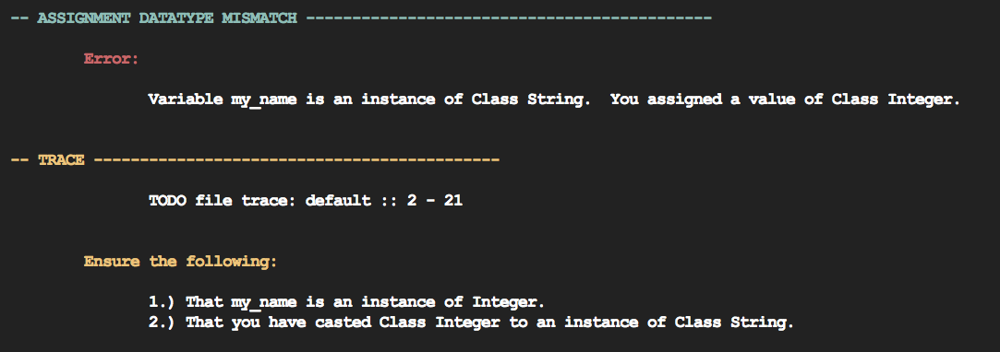

# The Gambit Language
This is a for-educational-purposes only programming language, compiler, and virtual machine.

## How to build this project
This project requires both a C (for extensions) and C++ compiler. By default it was tested on `GCC v8.1.0`, `clang version 4.0.0`, and `g++` with modifications to the makefile parameters. `sed` is also utilized to resolve and compile dependencies.

This project depends on bison v3.0.4 and flex v2.5.37. I can't guarantee it'll work on other versions, so they are included in the util package. Compile these two projects and update `build/gambit.mk` to point to their executables. You will also need to update the following line in the `Makefile` to include the header within util/flex as opposed to your system headers. You do not need to install these on your system, but the executables to generate the grammar files are needed.

```
INC         := -I$(INCDIR) -Isrc -Isrc/test -I$(LIBDIR) -I$(EXTDIR) -I/usr/local/opt/flex/include
```

Within the `build` directory, there is a bash file that will run various make commands to setup the mate compiler and its dependencies.

### What has this been tested on?
Mac, Ubuntu, CentOS.

### Will this work on Windows?
Possibly. If you utilize `clang v4.0` with C++ installed, set your PATH to include `mingw-w64`, and have `gnuwin32` on your system: you might be able to get Mate to compile. Due to different versions of `Flex`, `Bision`, and `Sed`, it is unlikely. 

Mate utilizes two external libraries, `args.hxx` for argument parsing, and `debugnew` for memory debugging. These both port over to Windows without an issue.  

Porting to Windows may come in the future.

## Gambit
Gambit is a strongly-typed, object-based, programming language. Not much has been implemented in the language as of yet.

```
# integers
10
12

# assignment
Integer::my_age = 24

```

## Check
Check is a human-readable error handler. Though optimized for the Mate compiler, it is a shared library that can be utilized for any C++ project. Features of Check are still being implemented and error messages continue to be improved upon.



### Handling Errors with Check
Check provides a simple interface for when you throw errors in your application. With Check, you have to wrap your application in a `try - catch` block in order to handle errors properly. Your errors must also implement the `iException` interface.

```cpp

class AssignDataTypeMismatch : public iException
{
	// ...
	const char * what () const throw ()
	{
		this->check->load(ASSIGN_DATATYPE_MISMATCH);
		std::vector<std::string> p;		
		p.push_back("ASSIGNMENT DATATYPE MISMATCH");
		
		return this->check->getFactory()->create()->with(p)->emit().c_str();
	};
}

try
{
	// some errorous code
	throw AssignDataTypeMismatch();
}
catch(Exception::iException &e)
{
	std::cout << e.what() << std::endl;
}
```


## Mate
An extensible compiler that accepts a language driver containing a parsed AST. Mate emits Pawn bytecode.

### Basic Usage
Mate has the following flags:

```
-h displays the help meny
-c[filename] compile a file
-o[outfile] output filename of pawn bytecode
```

Example: `matec -c test.gbt -o test.pwn`

### Extending Mate / Gambit
Mate provides a simple interface for creating extensions. Mate uses `dlfcn` for extensions, so you can utilize both C and C++. This is still under development. A generic Make file will be provided once the interface is finalized. Macros will also be defined.

The following headers are required to create an extension (with methods) in Mate:

```cpp
#include "shared/runtime/iStandardClass.hpp"
#include "shared/runtime/iMethod.hpp"
```

The extension signature has a `create` definition and `destroy` definition:

```cpp
extern "C" Runtime::iStandardClass* create(Runtime::iStandardClass* runtime)
{
  return runtime;
}

extern "C" void destroy(Runtime::iStandardClass* runtime)
{
	// mate will delete your object passed to the runtime.
	// ensure your destructor is virtual to do needed cleanup
	// use destroy to add some debugging, local variable deleting, etc.
}

```

#### Adding Objects to the Runtime
When creating an extension, using native C++ classes that extend `Runtime::iStandardClass` is the easiest approach.

```cpp
namespace Runtime
{

  class Sqlite : public Runtime::iStandardClass
  {

    private:
      sqlite3 *db;
      int rc;

    public:

      using Runtime::iStandardClass::iStandardClass;

      virtual ~Sqlite()
      {
        std::cout << "deleting sqlite" << std::endl;
      };

  };
}

#define SQLITE_CLASS_NAME "Sqlite"

extern "C" Runtime::iStandardClass* create(Runtime::iStandardClass* obj)
{
  Runtime::Sqlite *sqliteExt = new Runtime::Sqlite(SQLITE_CLASS_NAME);
 
  // Sqlite class inherits from Object in our runtime
  sqliteExt->setSuperClass(obj);

  // register our class in the runtime
  obj->setConstant(SQLITE_CLASS_NAME, sqliteExt);

  return sqliteExt;
}
```

#### Adding Methods
Methods are also objects. The method interface is currently incomplete, Mate does not yet recognize data types for method parameters and return types. You can, however, currently add methods and execute them within the C++ environment.

```cpp

namespace Runtime
{

  // .. previous code

  class SqliteInitializeMethod : public Runtime::iMethod
  {

    public:

      virtual Runtime::iStandardClass* call(Runtime::iStandardClass *receiver, std::vector<Runtime::iStandardClass*> arguments)
      {
        std::cout << "called initialize" << std::endl;
        return receiver;
      };

  };
}

extern "C" Runtime::iStandardClass* create(Runtime::iStandardClass* obj)
{
  Runtime::Sqlite *sqliteExt = new Runtime::Sqlite("Sqlite");

  sqliteExt->setSuperClass(obj);

  // bind native method to runtime "initialize" on sqlite object
  sqliteExt->addMethod("initialize", (new Runtime::SqliteInitializeMethod()));

  obj->setConstant("Sqlite", sqliteExt);

  return sqliteExt;
}

```

## Pawn
The bytecode output by the Mate Compiler.

| OP Code       | Operand 1     | Operand 2     | Operand 3     | Operand 4     | Description   |
| ------------- |:-------------:|:-------------:|:-------------:|:-------------:|:-------------:|
| NOOP		      | 				  | 	            |               |               | No operation  |
| PUSH_INTEGER  | Integer Obj   |               |               |               | Pushes an Integer onto the Stack |
| PUSH_STRING   | String Obj    |               |               |               | Pushes a String onto the Stack |
| PUSH_ARRAY    | Array Size n  |               |               |               | Pops n elements from the Stack and pushes an array|
| SET_LOCAL     | Class         | Identifier    |               |               | Pops top element on the Stack, sets local variable in current frame |
| POP           |               |               |               |               | Pops top element from the Stack |


